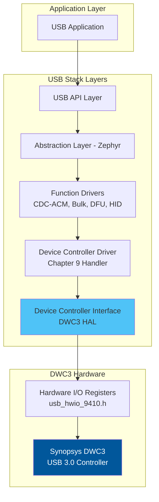

# DWC3 (DesignWare USB 3.0 Controller) Integration Analysis

## Executive Summary

Your USB stack **DOES contain comprehensive DWC3 support**. The code is specifically designed for Synopsys DesignWare USB 3.0 (DWC3) controller and includes all necessary components for DWC3 operation.

## DWC3 Architecture Overview



## Key DWC3 Components Found

### 1. **DCI Layer (Device Controller Interface)**
**Location**: `src/dci/usb_dci.c`, `inc/usb_dci_private.h`

This is the **Hardware Abstraction Layer (HAL)** specifically for Synopsys DWC3:

```c
/**
 * @brief USB Synopsys DCI (Device-Controller-Interface) implementation.
 * @details The DCI acts like a HAL for Synopsys USB Hardware.
 * @note This DCI is implementing the Synopsys hardware core.
 * @ref Synopsys DWC3 Databook
 */
```

**Key Features Implemented:**
- ✅ TRB (Transfer Request Block) management
- ✅ Event buffer handling
- ✅ Endpoint commands (DEPCMD)
- ✅ Device commands (DGCMD)
- ✅ USB 2.0 (High-Speed) and USB 3.0 (SuperSpeed) support
- ✅ Link Power Management (LPM) - U1/U2/U3 states
- ✅ Control, Bulk, Interrupt, and Isochronous transfers

### 2. **DWC3 Data Structures**

#### TRB (Transfer Request Block)
```c
typedef struct usb_trb {
  uint32 buf_ptr_lo;        // Buffer pointer low 32-bits
  uint32 buf_ptr_hi;        // Buffer pointer high 32-bits
  uint32 buf_size:24;       // Buffer size
  uint32 pcm1:2;
  uint32 rsvd0:2;
  uint32 trbsts:4;          // TRB status
  uint32 hwo:1;             // Hardware Owned
  uint32 lst:1;             // Last TRB
  uint32 chn:1;             // Chain
  uint32 csp:1;             // Continue on Short Packet
  uint32 trb_ctl:6;         // TRB Control
  uint32 isp_imi:1;
  uint32 ioc:1;             // Interrupt on Complete
  uint32 rsvd1:2;
  uint32 sid_sofn:16;       // Stream ID / SOF Number
  uint32 rsvd2:2;
} usb_trb_t;
```

#### Endpoint Commands
```c
// DWC3 Endpoint Commands (Chapter 6.3.2.5 of DWC3 Databook)
#define USB_EP_CMD_SET_EP_CONFIG_VAL              0x01
#define USB_EP_CMD_SET_EP_XFER_RSC_CONFIG_VAL     0x02
#define USB_EP_CMD_GET_EP_STATE_VAL               0x03
#define USB_EP_CMD_SET_STALL_VAL                  0x04
#define USB_EP_CMD_CLEAR_STALL_VAL                0x05
#define USB_EP_CMD_START_XFER_VAL                 0x06
#define USB_EP_CMD_UPDATE_XFER_VAL                0x07
#define USB_EP_CMD_END_XFER_VAL                   0x08
#define USB_EP_CMD_START_NEW_CONFIG_VAL           0x09
```

#### Device Commands
```c
// DWC3 Device Commands
#define USB_DEV_CMD_TX_SET_LINK_FN_LMP_VAL        0x01
#define USB_DEV_CMD_SET_PERIODIC_PARAMS_VAL       0x02
#define USB_DEV_CMD_TX_FN_WAKE_DEV_NOTIFY_VAL     0x03
#define USB_DEV_CMD_ALL_FIFO_FLUSH_VAL            0x0A
```

### 3. **Hardware Register Access**
**Location**: `inc/usb_hwio_9410.h`

Contains all DWC3 register definitions:
- `GSNPSID` - Synopsys ID register
- `GCTL` - Global Control
- `DCFG` - Device Configuration
- `DCTL` - Device Control
- `DEVTEN` - Device Event Enable
- `DSTS` - Device Status
- `DALEPENA` - Device Active Endpoint Enable
- `DEPCMD` - Device Endpoint Command
- And many more...

### 4. **Event Handling**

#### Event Buffer Structure
```c
typedef struct usb_event_buffer_info {
  void    *buf;
  uint32  cur_pos;
} usb_event_buffer_info_t;

#define EVENT_BUFFER_SIZE  (4*60)  // 240 bytes
```

#### Event Types
```c
// Endpoint Events
typedef enum usb_evt_ep_evt_t {
  USB_EVT_EP_XFER_COMPLETE = 1,
  USB_EVT_EP_XFER_IN_PROGRESS,
  USB_EVT_EP_XFER_NOT_READY,
  USB_EVT_EP_STREAM,
  USB_EVT_EP_CMD_COMPLETE
} usb_evt_ep_evt_type;

// Device Events
typedef enum usb_evt_dev_evt_t {
  USB_EVT_DEV_DISCONNECT_EVENT = 0,
  USB_EVT_DEV_USB_RESET,
  USB_EVT_DEV_CONNECT_DONE,
  USB_EVT_DEV_USB_LINK_STATE_CHANGE,
  USB_EVT_DEV_SUSPEND_ENTRY,
  // ... more events
} usb_evt_dev_evt_type;
```

## DWC3 Initialization Sequence

The initialization follows the DWC3 databook specifications:

```c
void usb_dci_hw_init(usb_dci_ctx_t* dci_ctx, usb_max_speed_required_t* max_speed)
{
  // 1. Release USB controller from reset
  HWIO_CHIP_CFG1_RST_USB_SS_OUT(0xE);
  usb_fn_util()->usb_delay_us(100);
  HWIO_CHIP_CFG1_RST_USB_SS_OUT(0x0);
  
  // 2. Enable clocks
  usb_fn_util()->usb_enable_clocks(&dci_ctx->is_usb_clk_on, TRUE);
  
  // 3. Initialize PHY
  usb_fn_dci_target()->usb_dci_hs_phy_init();
  
  // 4. Release USB from shutdown
  HWIO_CHIP_CFG1_PWR_MEM_SD_OUTM(...);
  
  // 5-20. Configure TX/RX FIFOs
  HWIO_USBCTL_GTXFIFOSIZ_REGS_p_GTXFIFOSIZ0_OUTI(0, 0x04DA0014);
  // ... more FIFO configurations
  
  // 21-24. Setup Event Buffer
  usb_fn_dci()->usb_dci_event_buffer_init(dci_ctx);
  
  // 25. Configure Global Control
  HWIO_USBCTL_GCTL_OUT(0x00102008);
  
  // 26. Configure Device Mode
  usb_fn_dci()->usb_dci_configure_device_mode(...);
  
  // 27. Enable Device Events
  HWIO_USBCTL_DEVTEN_OUT(...);
  
  // 28. Configure EP0
  usb_fn_dci()->usb_dci_core_init(dci_ctx);
  
  // 29. Enable EP0
  HWIO_USBCTL_DALEPENA_OUTM(...);
  
  // 30-31. Configure AHB transfers
  HWIO_USBCTL_GSBUSCFG1_OUT(0x1700);
  HWIO_USBCTL_GSBUSCFG0_OUTM(0x000000ff, 0x0);
  
  // 32. Set RUN/STOP bit
  HWIO_USBCTL_DCTL_OUT(reg_in);
}
```

## How to Use DWC3 in Your Code

### 1. **Basic Initialization**

```c
// Initialize DCI context
usb_dci_ctx_t* dci_ctx;
usb_max_speed_required_t max_speed = USB_MAX_SPEED_HIGH; // or USB_MAX_SPEED_SUPER

// Initialize hardware
usb_dci_hw_init(dci_ctx, &max_speed);

// Initialize DCI layer
usb_dci_init(core_id, &dci_ctx, dcd_ctx, callback_table, feature_flags);
```

### 2. **Configure Endpoints**

```c
// Configure a bulk endpoint
usb_dci_config_endpoint(
  dci_ctx,
  ep_num,              // Endpoint number (1-4)
  dir,                 // DIR_TX (IN) or DIR_RX (OUT)
  USB_EP_TYPE_BULK,    // Endpoint type
  0,                   // bInterval (for bulk = 0)
  max_packet_size,     // 512 for HS, 1024 for SS
  FALSE                // Zero length transfer
);
```

### 3. **Submit Transfer Requests**

```c
// Create URB (USB Request Block)
usb_urb_t urb;
urb.endpoint_address = ep_num | (dir ? 0x80 : 0x00);
urb.transfer_buffer_ptr = buffer;
urb.transfer_length = length;
urb.send_zlp = FALSE;
urb.complete_callback = my_callback;

// Submit transfer
usb_dci_transfer_request(dci_ctx, &urb);
```

### 4. **Handle Events**

```c
// Poll for events (call this periodically or in ISR)
usb_dci_poll_events(dci_ctx);

// Events are automatically dispatched to:
// - usb_dci_handle_ep_event() for endpoint events
// - usb_dci_handle_dev_event() for device events
```

### 5. **Control Transfer State Machine**

For EP0 control transfers, the DWC3 implementation handles the 3-stage process:

```
SETUP Stage → DATA Stage (optional) → STATUS Stage
```

The state machine is managed automatically:
```c
typedef enum {
  EP0_STATE_SETUP_TRB,
  EP0_STATE_INTRPT_SETUP,
  EP0_STATE_STATUS_2,      // 2-stage (no data)
  EP0_STATE_DATA,
  EP0_STATE_DATA_IN_PROGRESS,
  EP0_STATE_STATUS_3,      // 3-stage (with data)
  EP0_STATE_MAX
} usb_dci_ctrl_trb_state_t;
```

## DWC3 Features Supported

### ✅ USB Speeds
- **SuperSpeed (USB 3.0)**: 5 Gbps
- **High-Speed (USB 2.0)**: 480 Mbps
- **Full-Speed (USB 1.1)**: 12 Mbps
- **Low-Speed (USB 1.0)**: 1.5 Mbps

### ✅ Transfer Types
- **Control**: EP0 for enumeration and control
- **Bulk**: High-throughput data transfer
- **Interrupt**: Low-latency periodic transfers
- **Isochronous**: Time-sensitive streaming data

### ✅ Power Management
- **U0**: Active state
- **U1**: Low power state (quick exit)
- **U2**: Lower power state
- **U3**: Suspend state (L2)
- **L1**: LPM (Link Power Management) sleep state

### ✅ Advanced Features
- **Link Power Management (LPM)**
- **Remote Wakeup**
- **Test Modes** (J, K, SE0_NAK, Packet, Force Enable)
- **Isochronous Synchronization**
- **Stream Support**
- **Multiple Endpoints** (up to 5 configurable)

## Integration with Zephyr RTOS

The abstraction layer (`usb_al_zephyr.c`) provides:
- Thread management
- Signal/event handling
- Memory allocation
- Logging

## Hardware Platform

The code is designed for:
- **Chipset**: 9410 (Qualcomm platform)
- **PHY**: ULPI (UTMI+ Low Pin Interface) or UTMI
- **Target**: Both FPGA and ASIC

## Key APIs for Integration

### Initialization
```c
uint32 usb_dci_init(usb_core_type core_id, void** dci_ctx_ptr, 
                    void* dcd_ctx, usb_dcd_callback_t* cb_table_ptr, 
                    uint32 feature_flags);
void usb_dci_hw_init(usb_dci_ctx_t* dci_ctx, usb_max_speed_required_t* max_speed);
```

### Endpoint Management
```c
void usb_dci_config_endpoint(usb_dci_ctx_t* dci_ctx, uint8 ep, uint8 dir, 
                             uint8 ep_type, uint8 ep_interval, 
                             uint16 max_packet_length, boolean zero_length_transfer);
uint32 usb_dci_stall_endpoint(usb_dci_ctx_t* dci_ctx, uint8 ep, uint8 dir);
uint32 usb_dci_unstall_endpoint(usb_dci_ctx_t* dci_ctx, uint8 ep, uint8 dir);
```

### Data Transfer
```c
uint32 usb_dci_transfer_request(usb_dci_ctx_t* dci_ctx, usb_urb_t* urb_ptr);
uint32 usb_dci_cancel_transfer(usb_dci_ctx_t* dci_ctx, uint8 ep, uint8 dir);
```

### Event Handling
```c
void usb_dci_poll_events(usb_dci_ctx_t* dci_ctx);
```

### Device Control
```c
void usb_dci_set_address(uint8 address);
uint32 usb_dci_get_speed(usb_dci_ctx_t* dci_ctx);
void usb_dci_set_run_stop(usb_dci_ctx_t* dci_ctx, boolean set);
```

## Example Usage Flow

```c
// 1. Initialize USB stack
usb_dci_ctx_t* dci_ctx;
usb_max_speed_required_t speed = USB_MAX_SPEED_HIGH;

usb_dci_init(USB_CORE_0, &dci_ctx, dcd_ctx, &callbacks, features);
usb_dci_hw_init(dci_ctx, &speed);

// 2. Wait for enumeration (handled by DCD layer)
// Events: USB_RESET → CONNECT_DONE → SET_ADDRESS → SET_CONFIGURATION

// 3. Configure endpoints (after SET_CONFIGURATION)
usb_dci_config_endpoint(dci_ctx, 1, DIR_TX, USB_EP_TYPE_BULK, 0, 512, FALSE);
usb_dci_config_endpoint(dci_ctx, 1, DIR_RX, USB_EP_TYPE_BULK, 0, 512, FALSE);

// 4. Submit transfers
usb_urb_t tx_urb = {
  .endpoint_address = 0x81,  // EP1 IN
  .transfer_buffer_ptr = tx_buffer,
  .transfer_length = tx_length,
  .send_zlp = FALSE,
  .complete_callback = tx_complete_cb
};
usb_dci_transfer_request(dci_ctx, &tx_urb);

// 5. Poll for events in main loop or ISR
while (running) {
  usb_dci_poll_events(dci_ctx);
}

// 6. Cleanup
usb_dci_shutdown(&dci_ctx);
```

## Debugging and Logging

The stack includes comprehensive logging:
```c
USB_LOG(log_usb_dci_hw_init);
USB_LOG_ERR_1(log_usb_dci_handle_test_mode__test_mode_D, test_mode);
USB_LOG_DBG_2(log_usb_dci_submit_trb_data__ep_D_dir_D, ep, dir);
```

## References

1. **Synopsys DWC3 Databook** - Official hardware reference
2. **USB 2.0 Specification** - USB-IF
3. **USB 3.0 Specification** - USB-IF
4. **Code Documentation**:
   - `USB_ZEPHYR_HLD.md` - High-level design
   - `USB_ZEPHYR_INIT_SEQUENCE.md` - Initialization sequence
   - `CDC_ACM_INTEGRATION_GUIDE.md` - CDC-ACM integration

## Conclusion

Your USB stack has **complete DWC3 support** with:
- ✅ Full DWC3 register access and control
- ✅ TRB-based transfer management
- ✅ Event-driven architecture
- ✅ USB 2.0 and USB 3.0 support
- ✅ All transfer types (Control, Bulk, Interrupt, Isochronous)
- ✅ Power management (LPM, U1/U2/U3 states)
- ✅ Comprehensive error handling
- ✅ Well-documented and structured code

The implementation follows Synopsys DWC3 databook specifications and is production-ready for integration with Zephyr RTOS applications.
