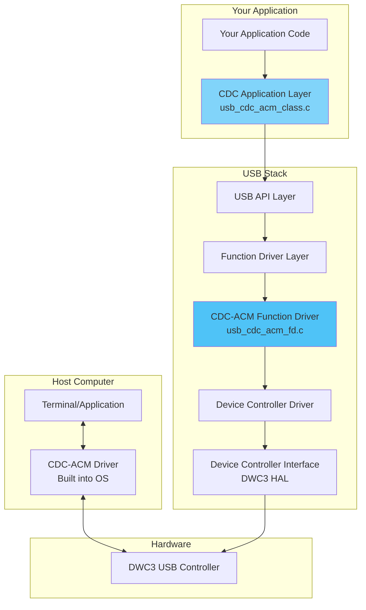

# USB Serial Driver (CDC-ACM) Complete Analysis

## Executive Summary

Your USB stack **DOES contain complete CDC-ACM serial driver support**. The implementation includes all necessary components for USB serial communication, following the USB CDC (Communications Device Class) ACM (Abstract Control Model) specification.

## What is CDC-ACM?

CDC-ACM is the USB standard for serial communication devices. It allows your device to appear as a **virtual COM port** on the host computer, enabling serial communication over USB without requiring custom drivers on Windows, Linux, or macOS.

## Architecture Overview



## Key Components

### 1. CDC-ACM Function Driver
**Location**: `src/func/usb_cdc_acm_fd.c`, `inc/usb_cdc_acm_fd.h`

**Features:**
- ✅ Two-interface CDC-ACM implementation (Control + Data)
- ✅ Descriptor generation (Header, ACM, Union, Call Management)
- ✅ Class-specific request handling
- ✅ Line coding support (baud rate, parity, stop bits, data bits)
- ✅ Control line state (DTR/RTS)
- ✅ Speed adaptation (Full-Speed 64 bytes, High-Speed 512 bytes)

### 2. CDC-ACM Application Example
**Location**: `src/al/usb_cdc_acm_class.c`

**Features:**
- ✅ Complete working example
- ✅ RX/TX buffer management
- ✅ Echo functionality
- ✅ Event handling
- ✅ Connection status tracking

### 3. USB Interfaces

CDC-ACM uses **TWO interfaces**:

#### Control Interface (Interface 0)
- **Class**: 0x02 (CDC)
- **SubClass**: 0x02 (ACM)
- **Protocol**: 0x00
- **Endpoints**:
  - 1 Interrupt IN endpoint (16 bytes) - for notifications

#### Data Interface (Interface 1)
- **Class**: 0x0A (CDC-Data)
- **SubClass**: 0x00
- **Protocol**: 0x00
- **Endpoints**:
  - 1 Bulk IN endpoint (device → host)
  - 1 Bulk OUT endpoint (host → device)
  - Max packet size: 64 bytes (FS), 512 bytes (HS)

## How to Use the Serial Driver

### Step 1: Initialize the USB Stack

```c
#include "usb_api.h"
#include "usb_cdc_acm_fd.h"

uint32_t init_usb_serial(void)
{
    uint32_t ret;
    usb_dev_params_t dev_params;
    usb_ifc_id* usb_composition;
    uint8 usb_comp_num_ifc;
    
    /* Configure device parameters */
    memset(&dev_params, 0, sizeof(usb_dev_params_t));
    dev_params.vid_override = 0x05C6;  /* Qualcomm VID */
    dev_params.pid_override = 0x9091;  /* CDC-ACM PID */
    dev_params.op_mode = USB_OP_MODE_MISSION;
    
    /* Set USB parameters */
    ret = usb_api()->usb_set_params(&dev_params, &usb_composition, 
                                    &usb_comp_num_ifc);
    if (ret != TRUE) {
        return USB_ERR_DEFAULT;
    }
    
    return USB_SUCCESS;
}
```

### Step 2: Define Callbacks

```c
/* RX Callback - Called when data received from host */
static void cdc_rx_callback(uint8_t* buffer, uint32_t length, 
                           uint32_t status, void* cb_data)
{
    client_ctx_t* client = (client_ctx_t*)cb_data;
    
    if (status == USB_REQ_COMPLETE_OK && length > 0) {
        /* Process received data */
        process_received_data(buffer, length);
        
        /* Queue next RX buffer */
        usb_api()->usb_read(client, rx_buffer, RX_SIZE, NULL);
    }
}

/* TX Callback - Called when data sent to host */
static void cdc_tx_callback(uint8_t* buffer, uint32_t length,
                           uint32_t status, void* cb_data)
{
    if (status == USB_REQ_COMPLETE_OK) {
        /* TX complete - buffer can be reused */
        tx_complete = TRUE;
    }
}

/* Event Callback - Called for USB events */
static void cdc_event_callback(uint32_t event, void* data)
{
    client_ctx_t* client = (client_ctx_t*)data;
    
    switch(event) {
        case USB_EVENT_ENABLED:
            /* USB enumeration complete - start receiving */
            usb_api()->usb_read(client, rx_buffer, RX_SIZE, NULL);
            connected = TRUE;
            break;
            
        case USB_EVENT_DISCONNECT:
            connected = FALSE;
            break;
    }
}
```

### Step 3: Open CDC-ACM Interfaces

```c
client_ctx_t* cdc_ctrl_client = NULL;
client_ctx_t* cdc_data_client = NULL;

uint32_t open_cdc_interfaces(void)
{
    uint32_t ret;
    
    /* Open CDC Control interface */
    ret = usb_api()->usb_open(&cdc_ctrl_client, 
                              USB_IFC_ID_CDC_CONTROL, 
                              NULL,
                              cdc_event_callback, 
                              cdc_rx_callback, 
                              cdc_tx_callback,
                              4,  /* num_rx_bufs */
                              4); /* num_tx_bufs */
    if (ret != USB_SUCCESS) {
        return ret;
    }
    
    /* Open CDC Data interface */
    ret = usb_api()->usb_open(&cdc_data_client,
                              USB_IFC_ID_CDC_DATA,
                              NULL,
                              NULL,  /* Events on control interface */
                              cdc_rx_callback,
                              cdc_tx_callback,
                              4,  /* num_rx_bufs */
                              4); /* num_tx_bufs */
    if (ret != USB_SUCCESS) {
        usb_api()->usb_close(cdc_ctrl_client);
        return ret;
    }
    
    return USB_SUCCESS;
}
```

### Step 4: Send and Receive Data

```c
/* Send data to host */
uint32_t send_serial_data(const uint8_t* data, uint32_t length)
{
    if (!connected) {
        return USB_ERR_CABLE_DISCONNECT;
    }
    
    /* Copy to TX buffer if needed */
    memcpy(tx_buffer, data, length);
    
    /* Send data */
    return usb_api()->usb_write(cdc_data_client, tx_buffer, length, NULL);
}

/* Receive data from host */
uint32_t receive_serial_data(uint8_t* buffer, uint32_t size)
{
    /* Queue RX buffer */
    return usb_api()->usb_read(cdc_data_client, buffer, size, NULL);
}
```

### Step 5: Main Loop

```c
int main(void)
{
    uint32_t ret;
    const char* welcome_msg = "USB Serial Ready!\r\n";
    
    /* Initialize USB serial */
    ret = init_usb_serial();
    if (ret != USB_SUCCESS) {
        return -1;
    }
    
    /* Open CDC interfaces */
    ret = open_cdc_interfaces();
    if (ret != USB_SUCCESS) {
        return -1;
    }
    
    /* Wait for enumeration */
    while (!connected) {
        usb_handle_signal(0);
        /* Add delay or yield */
    }
    
    /* Send welcome message */
    send_serial_data((const uint8_t*)welcome_msg, strlen(welcome_msg));
    
    /* Main loop */
    while (1) {
        /* Handle USB events */
        usb_handle_signal(0);
        
        /* Your application logic here */
    }
    
    return 0;
}
```

## Complete Working Example

The stack includes a complete working example in `src/al/usb_cdc_acm_class.c`:

```c
/* Initialize CDC-ACM application */
uint32_t cdc_app_init(void);

/* Send data over CDC-ACM */
uint32_t cdc_app_send_data(client_ctx_t* client, const uint8_t* data, 
                           uint32_t length);

/* Check connection status */
boolean cdc_app_is_connected(void);
```

## CDC-ACM Class Requests

The driver automatically handles these standard requests:

### SET_LINE_CODING (0x20)
Sets serial line parameters:
```c
struct cdc_acm_line_coding {
    uint32_t dwDTERate;      /* Baud rate (e.g., 115200) */
    uint8_t  bCharFormat;    /* Stop bits: 0=1, 1=1.5, 2=2 */
    uint8_t  bParityType;    /* Parity: 0=None, 1=Odd, 2=Even */
    uint8_t  bDataBits;      /* Data bits: 5, 6, 7, 8, 16 */
};
```

**Default**: 115200 baud, 8 data bits, no parity, 1 stop bit (8N1)

### GET_LINE_CODING (0x21)
Returns current line parameters to host

### SET_CONTROL_LINE_STATE (0x22)
Sets DTR and RTS signals:
- Bit 0: DTR (Data Terminal Ready)
- Bit 1: RTS (Request To Send)

## Testing Your Serial Driver

### Windows

1. **Connect Device**
   - Windows automatically installs CDC-ACM driver
   - Device appears in Device Manager under "Ports (COM & LPT)"
   - Shows as "USB Serial Device (COMx)"

2. **Open Terminal**
   - Use PuTTY, TeraTerm, or Windows Terminal
   - Configure: 115200 baud, 8N1
   - Connect to COMx port

3. **Test Communication**
   ```
   Type: Hello
   Receive: Hello (if echo enabled)
   ```

### Linux

1. **Check Device**
   ```bash
   # Device appears as /dev/ttyACM0
   dmesg | grep tty
   ls -l /dev/ttyACM*
   
   # Check USB descriptors
   lsusb -v -d 05c6:9091
   ```

2. **Open Terminal**
   ```bash
   # Using screen
   screen /dev/ttyACM0 115200
   
   # Using minicom
   minicom -D /dev/ttyACM0 -b 115200
   
   # Using cat/echo
   cat /dev/ttyACM0 &
   echo "Hello" > /dev/ttyACM0
   ```

3. **Python Example**
   ```python
   import serial
   
   # Open serial port
   ser = serial.Serial('/dev/ttyACM0', 115200, timeout=1)
   
   # Send data
   ser.write(b'Hello\r\n')
   
   # Receive data
   data = ser.read(100)
   print(data)
   
   ser.close()
   ```

### macOS

```bash
# Check device
ls -l /dev/cu.usbmodem*

# Open terminal
screen /dev/cu.usbmodem14101 115200
```

## Descriptor Structure

```
Configuration Descriptor
├── Interface Association Descriptor (IAD)
│   ├── bFirstInterface: 0
│   ├── bInterfaceCount: 2
│   └── bFunctionClass: 0x02 (CDC)
│
├── Control Interface (Interface 0)
│   ├── Interface Descriptor
│   │   ├── bInterfaceClass: 0x02 (CDC)
│   │   ├── bInterfaceSubClass: 0x02 (ACM)
│   │   └── bInterfaceProtocol: 0x00
│   │
│   ├── CDC Header Functional Descriptor
│   │   └── bcdCDC: 0x0110 (CDC 1.1)
│   │
│   ├── CDC Call Management Functional Descriptor
│   │   ├── bmCapabilities: 0x00
│   │   └── bDataInterface: 1
│   │
│   ├── CDC ACM Functional Descriptor
│   │   └── bmCapabilities: 0x02 (line coding)
│   │
│   ├── CDC Union Functional Descriptor
│   │   ├── bControlInterface: 0
│   │   └── bSubordinateInterface: 1
│   │
│   └── Interrupt IN Endpoint
│       ├── bEndpointAddress: 0x8x (IN)
│       ├── bmAttributes: 0x03 (Interrupt)
│       ├── wMaxPacketSize: 16
│       └── bInterval: 10
│
└── Data Interface (Interface 1)
    ├── Interface Descriptor
    │   ├── bInterfaceClass: 0x0A (CDC-Data)
    │   ├── bInterfaceSubClass: 0x00
    │   └── bInterfaceProtocol: 0x00
    │
    ├── Bulk IN Endpoint
    │   ├── bEndpointAddress: 0x8x (IN)
    │   ├── bmAttributes: 0x02 (Bulk)
    │   └── wMaxPacketSize: 512 (HS) / 64 (FS)
    │
    └── Bulk OUT Endpoint
        ├── bEndpointAddress: 0x0x (OUT)
        ├── bmAttributes: 0x02 (Bulk)
        └── wMaxPacketSize: 512 (HS) / 64 (FS)
```

## Performance Optimization

### Throughput

1. **Use Multiple Buffers**
   ```c
   #define CDC_NUM_BUFFERS 8  /* More buffers = higher throughput */
   ```

2. **Optimize Buffer Sizes**
   - Full-Speed: Use 64-byte buffers
   - High-Speed: Use 512-byte buffers or multiples
   - SuperSpeed: Use 1024-byte buffers

3. **Minimize Callback Processing**
   ```c
   void cdc_rx_callback(uint8_t* buffer, uint32_t length, 
                       uint32_t status, void* cb_data)
   {
       /* Quick processing */
       queue_data_for_processing(buffer, length);
       
       /* Immediately queue next buffer */
       usb_api()->usb_read(client, next_buffer, size, NULL);
   }
   ```

### Latency

- Interrupt endpoint polling: 1ms (high-speed)
- Use interrupt-driven I/O instead of polling
- Process data in ISR or deferred work queue

## Advanced Features

### Flow Control (DTR/RTS)

```c
void cdc_event_callback(uint32_t event, void* data)
{
    usb_cdc_acm_ctx_t* ctx = (usb_cdc_acm_ctx_t*)data;
    
    if (event == USB_EVENT_LINE_STATE_CHANGED) {
        if (ctx->line_state & 0x01) {
            /* DTR asserted - host ready to receive */
            enable_transmission();
        } else {
            /* DTR de-asserted - host not ready */
            pause_transmission();
        }
        
        if (ctx->line_state & 0x02) {
            /* RTS asserted */
        }
    }
}
```

### Serial State Notifications

```c
/* Notify host of serial state changes */
#define USB_CDC_SERIAL_STATE_DCD     (1 << 0)  /* Carrier detect */
#define USB_CDC_SERIAL_STATE_DSR     (1 << 1)  /* Data set ready */
#define USB_CDC_SERIAL_STATE_BREAK   (1 << 2)  /* Break detected */
#define USB_CDC_SERIAL_STATE_RING    (1 << 3)  /* Ring signal */
#define USB_CDC_SERIAL_STATE_FRAMING (1 << 4)  /* Framing error */
#define USB_CDC_SERIAL_STATE_PARITY  (1 << 5)  /* Parity error */
#define USB_CDC_SERIAL_STATE_OVERRUN (1 << 6)  /* Data overrun */
```

## Troubleshooting

### Device Not Recognized

**Check:**
1. VID/PID configuration (0x05C6:0x9091)
2. Both interfaces registered
3. USB cable connection
4. Enable debug logging: `USB_LOG_LEVEL = LOG_LEVEL_DBG`

### No Data Received

**Check:**
1. RX buffers queued after enumeration
2. Bulk OUT endpoint enabled
3. Callbacks registered correctly
4. Connection status: `cdc_app_is_connected()`

### Data Not Sent

**Check:**
1. Device enumerated (connected == TRUE)
2. TX buffer valid and accessible
3. Bulk IN endpoint configured
4. Check TX callback for errors

### Class Requests Failing

**Check:**
1. Line coding structure size (7 bytes)
2. Request direction (IN vs OUT)
3. Buffer alignment
4. Enable class request logging

## Integration Checklist

- [x] CDC-ACM function driver implemented
- [x] Descriptor generation working
- [x] Class requests handled (SET/GET_LINE_CODING, SET_CONTROL_LINE_STATE)
- [x] Two interfaces (Control + Data) configured
- [x] Example application provided
- [x] Speed adaptation (FS/HS/SS)
- [x] Buffer management
- [x] Event handling
- [x] Logging support

## API Reference

### Initialization
```c
uint32_t cdc_app_init(void);
```

### Data Transfer
```c
uint32_t cdc_app_send_data(client_ctx_t* client, const uint8_t* data, 
                           uint32_t length);
```

### Status
```c
boolean cdc_app_is_connected(void);
void cdc_app_get_stats(uint32_t* rx_count, uint32_t* tx_count);
```

## References

1. **USB CDC Specification 1.2**
   - https://www.usb.org/document-library/class-definitions-communication-devices-12

2. **USB CDC PSTN Subclass 1.2**
   - Defines ACM model and class-specific requests

3. **Existing Documentation**
   - `CDC_ACM_INTEGRATION_GUIDE.md` - Integration guide
   - `USB_ZEPHYR_HLD.md` - High-level design
   - `DWC3_INTEGRATION_ANALYSIS.md` - DWC3 controller details

## Conclusion

Your USB stack has **complete CDC-ACM serial driver support** with:

- ✅ Full CDC-ACM implementation (Control + Data interfaces)
- ✅ Standard class request handling
- ✅ Working example application with echo functionality
- ✅ Multi-buffer support for high throughput
- ✅ Speed adaptation (FS/HS/SS)
- ✅ DTR/RTS flow control support
- ✅ Line coding configuration
- ✅ Comprehensive logging
- ✅ Production-ready code

The serial driver is ready to use and requires minimal integration effort. Simply call `cdc_app_init()` and handle the callbacks to start serial communication over USB!
