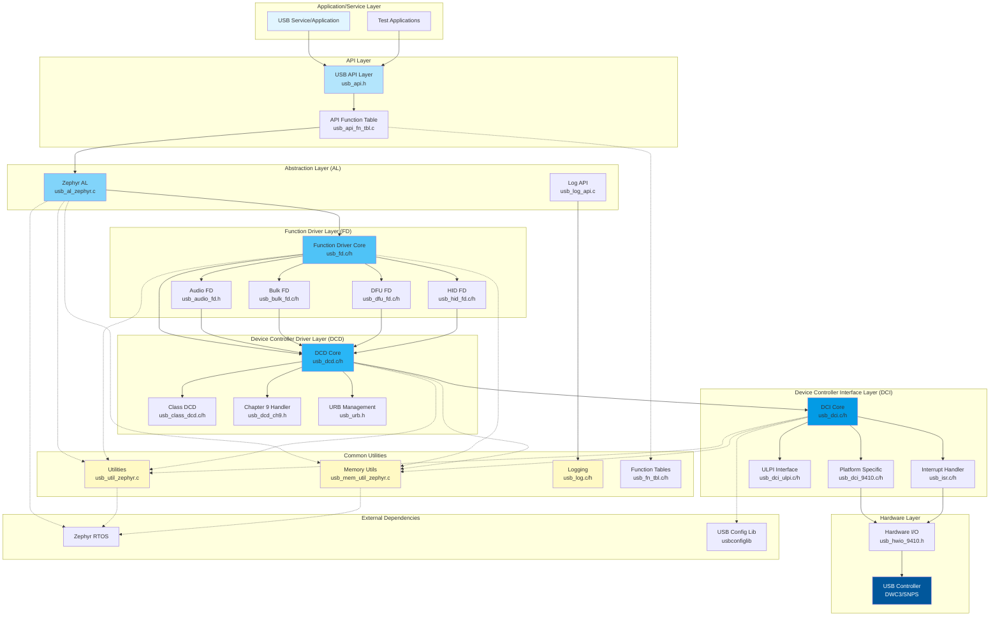

# USB Zephyr Stack - High Level Design (HLD)

## Overview
The USB Zephyr stack is a layered USB device stack implementation for Zephyr RTOS, supporting USB 2.0 and USB 3.0 (SuperSpeed) operations. The architecture follows a modular design with clear separation of concerns across multiple layers.

## Architecture Block Diagram



## Layer Descriptions

### 1. Application/Service Layer
- **Purpose**: Top-level USB applications and services
- **Components**:
  - USB Service applications
  - Test applications
- **Responsibilities**:
  - Initialize USB stack
  - Configure USB parameters
  - Handle application-specific USB events

### 2. API Layer
- **Purpose**: Provides unified API interface for applications
- **Key Files**:
  - `usb_api.h` - Main API definitions
  - `usb_api_fn_tbl.c` - Function table implementation
- **Key Functions**:
  - `usb_set_params()` - Configure USB device parameters
  - `usb_open()` - Register USB client
  - `usb_read()` / `usb_write()` - Data transfer
  - `usb_close()` - Unregister client
  - `usb_thread_init()` - Initialize USB thread
  - `usb_handle_signal()` - Handle USB events

### 3. Abstraction Layer (AL)
- **Purpose**: Platform abstraction for Zephyr RTOS
- **Key Files**:
  - `usb_al_zephyr.c` - Zephyr-specific adaptations
  - `usb_log_api.c` - Logging interface
- **Responsibilities**:
  - OS-specific thread management
  - Signal/event handling
  - Memory allocation wrappers
  - Logging abstraction

### 4. Function Driver Layer (FD)
- **Purpose**: Implements USB device class functionality
- **Supported Classes**:
  - **Audio** (`usb_audio_fd.h`) - USB Audio Class (UAC 1.0/2.0/3.0)
  - **Bulk** (`usb_bulk_fd.c/h`) - Bulk transfer endpoints
  - **DFU** (`usb_dfu_fd.c/h`) - Device Firmware Upgrade
  - **HID** (`usb_hid_fd.c/h`) - Human Interface Device
- **Responsibilities**:
  - Class-specific descriptor management
  - Class-specific request handling
  - Endpoint configuration
  - Data transfer management

### 5. Device Controller Driver Layer (DCD)
- **Purpose**: USB device controller abstraction
- **Key Files**:
  - `usb_dcd.c/h` - Core DCD implementation
  - `usb_class_dcd.c/h` - Class-specific DCD handlers
  - `usb_dcd_ch9.h` - USB Chapter 9 (standard requests)
  - `usb_urb.h` - USB Request Block management
- **Responsibilities**:
  - USB descriptor management (device, config, string, BOS)
  - Standard USB request handling (Chapter 9)
  - Configuration and interface management
  - Endpoint management
  - URB (USB Request Block) submission
  - Control transfer handling
  - USB state machine management

### 6. Device Controller Interface Layer (DCI)
- **Purpose**: Hardware controller interface
- **Key Files**:
  - `usb_dci.c/h` - Core DCI implementation
  - `usb_dci_9410.c/h` - Platform-specific (9410 chipset)
  - `usb_dci_ulpi.c/h` - ULPI PHY interface
  - `usb_isr.c/h` - Interrupt service routines
- **Responsibilities**:
  - Hardware register access
  - Interrupt handling
  - DMA management
  - PHY configuration
  - Speed detection (HS/SS)
  - Power management (U1/U2 states)
  - Test mode support

### 7. Hardware Layer
- **Components**:
  - `usb_hwio_9410.h` - Hardware I/O definitions
  - USB Controller (DWC3/Synopsys)
- **Responsibilities**:
  - Physical USB transactions
  - Signal integrity
  - Power delivery

### 8. Common Utilities
- **Purpose**: Shared utility functions
- **Components**:
  - **Utilities** (`usb_util_zephyr.c`) - Helper functions
  - **Memory** (`usb_mem_util_zephyr.c`) - Memory management
  - **Logging** (`usb_log.c/h`) - Debug logging
  - **Function Tables** (`usb_fn_tbl.c/h`) - Function pointer tables

## Data Flow

### Initialization Flow
```
Application → API → AL → FD → DCD → DCI → Hardware
```

### Enumeration Flow
```
Hardware (USB Reset) → ISR → DCI → DCD (handle_reset) → FD (notify)
Hardware (Setup Packet) → ISR → DCI → DCD (handle_setup) → FD (class-specific)
```

### Data Transfer Flow (TX)
```
Application → API (usb_write) → FD → DCD (submit_urb) → DCI (transfer_request) → Hardware
Hardware (Complete) → ISR → DCI → DCD → FD (callback) → Application
```

### Data Transfer Flow (RX)
```
Application → API (usb_read) → FD → DCD (submit_urb) → DCI (transfer_request) → Hardware
Hardware (Data Ready) → ISR → DCI → DCD → FD (callback) → Application
```

## Key Features

### USB Standards Support
- USB 2.0 (High-Speed, Full-Speed)
- USB 3.0 (SuperSpeed)
- USB Chapter 9 compliance
- Link Power Management (LPM)
- U1/U2 low power states (USB 3.0)

### Transfer Types
- Control transfers (EP0)
- Bulk transfers
- Interrupt transfers
- Isochronous transfers

### Device Classes
- USB Audio Class (UAC 1.0/2.0/3.0)
- USB HID (Human Interface Device)
- USB DFU (Device Firmware Upgrade)
- Custom bulk endpoints

### Platform Features
- Zephyr RTOS integration
- Thread-safe operation
- Signal-based event handling
- Dynamic descriptor generation
- Multiple interface support
- Composite device support

## Configuration

### Build System
- CMake-based build (`CMakeLists.txt`)
- SCons support (`build/usb.scons`)

### Key Configuration Parameters
- Vendor ID / Product ID
- Device descriptors
- Interface configurations
- Endpoint configurations
- Buffer sizes
- Feature flags

## Memory Management
- Cached and uncached memory allocation
- DMA-capable buffer management
- Dynamic descriptor allocation
- URB pool management

## Interrupt Handling
- USB controller interrupts
- VBUS detection
- Power events
- Transfer completion
- Error conditions

## Debug and Logging
- Hierarchical logging system
- Log levels (ERROR, WARNING, INFO, DEBUG)
- Platform-specific log output
- USB event tracing

## Dependencies

### Internal
- USB Config Library (`core/usb/usbconfiglib`)
- Common definitions (`comdef.h`)

### External
- Zephyr RTOS
- Platform-specific hardware drivers

## File Organization

```
battman/usb/usb_zephyr/
├── inc/                    # Public headers
│   ├── usb_api.h          # Main API
│   ├── usb_audio.h        # Audio definitions
│   ├── usb_common.h       # Common definitions
│   ├── usb_dfu.h          # DFU definitions
│   ├── usb_hid_api.h      # HID API
│   └── usb_svc_data.h     # Service data structures
├── src/
│   ├── al/                # Abstraction Layer
│   ├── common/            # Common utilities
│   ├── dcd/               # Device Controller Driver
│   ├── dci/               # Device Controller Interface
│   └── func/              # Function Drivers
├── build/                 # Build files
└── CMakeLists.txt        # Build configuration
```

## Notes
- Files with `_NA` suffix are not active (platform-specific alternatives)
- Function tables provide indirection for modularity
- Hardware-specific code isolated in DCI layer
- Zephyr-specific code isolated in AL layer
