# USB Zephyr Initialization Sequence Diagram

This document provides a detailed sequence diagram for the USB Zephyr initialization flow starting from `usb_zephyr_init()`.

## Sequence Diagram

```mermaid
sequenceDiagram
    participant Zephyr as Zephyr OS
    participant Init as usb_zephyr_init()
    participant API as USB API Layer
    participant AL as Adaptation Layer (AL)
    participant FD as Function Driver (FD)
    participant DCD as Device Controller Driver (DCD)
    participant DCI as Device Controller Interface (DCI)
    participant ISR as ISR Handler
    participant MEM as Memory Manager
    participant Client as USB Clients

    Note over Zephyr,Client: System Initialization Phase
    Zephyr->>Init: SYS_INIT(usb_zephyr_init, APPLICATION, CONFIG_QC_CHGFW_USB_DRIVERS)
    
    Note over Init,API: Event System Setup
    Init->>Init: k_event_init(&usb_events)
    Init->>API: usb_thread_init(&usb_events)
    
    Note over API,MEM: Memory & Context Initialization
    API->>API: usb_os_spinlock_init()
    API->>MEM: usb_mem_init()
    MEM-->>API: Memory pools initialized
    
    API->>AL: usb_ctx_init()
    
    Note over AL,MEM: USB Context Allocation
    AL->>MEM: usb_malloc(sizeof(usb0_ctx_t))
    MEM-->>AL: usb0_ctx allocated
    
    AL->>AL: Initialize usb0_ctx fields
    Note right of AL: - is_enumerated = FALSE<br/>- vbus_high = TRUE<br/>- fd_ctx = NULL<br/>- Setup ISR context<br/>- Setup callbacks
    
    AL->>AL: usb_get_acdb_params(usb_params)
    Note right of AL: Get device parameters<br/>(vendor ID, product ID, etc.)
    
    AL->>AL: usb_set_halt_on_err(feature_flags)
    
    Note over AL,MEM: Log Buffer Initialization
    AL->>AL: usb_log_buffer_init(&usb0_ctx->log_ptr)
    
    API-->>Init: Initialization complete
    Init-->>Zephyr: Return TRUE

    Note over Zephyr,Client: Client Registration Phase
    Client->>AL: usb_alloc_register_client_ctx()
    
    AL->>MEM: usb_malloc(sizeof(client_ctx_t))
    MEM-->>AL: client_ctx allocated
    
    AL->>AL: Setup client context
    Note right of AL: - ifc_id<br/>- event callbacks<br/>- rx/tx callbacks<br/>- client data
    
    AL->>AL: usb_register_client(client_ctx)
    
    alt All Clients Registered
        AL->>AL: usb_client_cnt() == usb_comp_num_ifc
        AL->>AL: usb_al_hlos_bulk_init(speed_required)
        
        Note over AL,FD: Hardware Initialization Phase
        AL->>AL: usb_log_buffer_init(&usb0_ctx->log_ptr)
        AL->>AL: usb_os_spinlock_lock()
        
        AL->>FD: usb_fd_init(&fd_ctx, api_cb, dev_cfg, speed_required)
        
        Note over FD,MEM: Function Driver Setup
        FD->>MEM: usb_malloc(sizeof(usb_fd_ctx_t))
        MEM-->>FD: fd_ctx allocated
        
        FD->>FD: Setup fd_ctx
        Note right of FD: - api_cb callbacks<br/>- dev_cfg<br/>- dsc_init = FALSE
        
        Note over FD,Client: Interface Context Initialization
        FD->>MEM: usb_malloc(sizeof(ifc_ctx_t) * n_ifc)
        MEM-->>FD: ifc_ctx array allocated
        
        loop For each interface
            FD->>FD: Initialize interface class
            Note right of FD: Based on ifc_id:<br/>- USB_IFC_ID_BULK<br/>- USB_IFC_ID_AUDIO_CONTROL<br/>- USB_IFC_ID_HID<br/>- USB_IFC_ID_DFU
            
            FD->>FD: Setup function pointers
            Note right of FD: - init<br/>- alloc_desc<br/>- set_cfg<br/>- notify_speed<br/>- deinit
        end
        
        Note over FD,DCD: Device Controller Driver Init
        FD->>DCD: usb_dcd_init(speed_required, &dcd_ctx, fd_ctx, fd_cb, ...)
        
        DCD->>MEM: usb_malloc(sizeof(usb_dcd_ctx_t))
        MEM-->>DCD: dcd_ctx allocated
        
        DCD->>DCD: usb_dcd_allocate_strings(lang_id, manuf_str, product_str)
        DCD->>DCD: usb_dcd_allocate_dev_qual(&dev_qual)
        
        DCD->>DCD: Initialize dcd_ctx
        Note right of DCD: - speed_required<br/>- fd_ctx & callbacks<br/>- speed = UNKNOWN<br/>- address = 0<br/>- config_value = 0
        
        DCD->>MEM: usb_malloc_uncached(USB_VENDOR_BUFF_SIZE)
        MEM-->>DCD: vendor_buff allocated
        
        DCD->>MEM: usb_malloc_uncached(USB_MAX_CTRL_PKT_SIZE)
        MEM-->>DCD: setup_data & setup_status allocated
        
        Note over DCD,DCI: Device Controller Interface Init
        DCD->>DCI: usb_dci_init(core_id, &dci_ctx, dcd_ctx, dcd_cb, feature_flags)
        
        DCI->>MEM: usb_malloc(sizeof(usb_dci_ctx_t))
        MEM-->>DCI: dci_ctx allocated
        
        DCI->>DCI: Initialize DCI context
        Note right of DCI: - core_id<br/>- dcd_ctx<br/>- callbacks<br/>- feature_flags
        
        DCI->>DCI: usb_dci_hw_init(dci_ctx, &speed_required)
        
        Note over DCI: Hardware Controller Setup
        DCI->>DCI: Configure USB controller registers
        DCI->>DCI: Setup endpoints
        DCI->>DCI: Enable interrupts
        
        DCI-->>DCD: DCI initialized
        DCD-->>FD: DCD initialized
        
        FD->>DCD: usb_dcd_set_core(dcd_ctx, USB_CORE_SNPS)
        
        Note over FD,DCD: Control Transfer Setup
        DCD->>DCD: usb_dcd_ctrl_start_xfer(dcd_ctx)
        DCD->>DCI: usb_dci_transfer_request(dci_ctx, ctrl_urb.rx)
        Note right of DCD: Setup EP0 for receiving<br/>SETUP packets
        
        FD-->>AL: fd_ctx initialized
        
        Note over AL,ISR: ISR Initialization
        AL->>ISR: usb_isr_init(&isr_ctx)
        
        ISR->>ISR: Setup ISR context
        Note right of ISR: - usb_events<br/>- dci_ctx<br/>- pwr_handle<br/>- vbus_handle
        
        ISR->>ISR: Register interrupt handlers
        ISR->>ISR: Enable USB interrupts
        
        ISR-->>AL: ISR initialized
        
        AL->>MEM: usb_print_meminfo()
        AL->>AL: usb_os_spinlock_unlock()
    end

    Note over Zephyr,Client: Runtime Event Handling
    
    alt VBUS Event
        ISR->>AL: usb_al_hlos_isr_vbus_event(vbus_high)
        AL->>API: usb_handle_signal(USB_VBUS_EVENT_FLAG)
        API->>API: k_event_set(&usb_events, USB_VBUS_EVENT_FLAG)
        
        Note over API: Event thread processes signal
        API->>AL: usb_handle_signal(USB_VBUS_EVENT_FLAG)
        
        alt VBUS High & Not Enumerated
            AL->>AL: usb_al_hlos_bulk_init(speed_required)
            Note right of AL: Re-initialize if needed
        else VBUS Low & Enumerated
            AL->>AL: usb_al_hlos_disconnect_handler()
            AL->>FD: usb_fd_shutdown(&fd_ctx)
            loop For each client
                AL->>Client: app_event_cb_func(USB_EVENT_DISCONNECT, NULL)
            end
        end
    end
    
    alt Power Event
        ISR->>AL: usb_al_hlos_isr_pwr_event(event_id)
        AL->>API: usb_handle_signal(USB_PWR_EVENT_QUEUE_FLAG)
        API->>ISR: usb_dsr_handle_pwr_event(&isr_ctx)
    end
    
    alt Enumeration Complete
        DCD->>AL: enum_complete(TRUE)
        AL->>API: usb_handle_signal(USB_ENUM_DONE_FLAG)
        
        Note over API: Event thread processes signal
        API->>AL: usb_handle_signal(USB_ENUM_DONE_FLAG)
        
        loop For each client
            AL->>Client: app_event_cb_func(USB_EVENT_ENABLED, NULL)
        end
    end
    
    alt USB Reset
        DCI->>DCD: usb_dcd_notify(USB_DCD_EVT_RESET)
        DCD->>DCD: usb_dcd_handle_reset()
        DCD->>DCD: usb_dcd_set_config(0)
        DCD->>DCI: usb_dci_set_address(0)
        DCD->>FD: usb_fd_notify(USB_DCD_EVT_RESET)
        FD->>AL: usb_handle_reset()
    end
    
    alt Speed Detection
        DCI->>DCD: usb_dcd_notify(USB_DCD_EVT_SPEED)
        DCD->>DCD: usb_dcd_port_status_changed()
        DCD->>DCI: usb_dci_get_speed()
        DCI-->>DCD: speed
        DCD->>DCD: usb_dcd_create_desc(vendor_id, product_id, n_cfg)
        DCD->>FD: usb_fd_notify(USB_DCD_EVT_SPEED)
    end
    
    alt Configuration Set
        DCI->>DCD: usb_dcd_notify(USB_DCD_EVT_CONFIG)
        DCD->>FD: usb_fd_notify(USB_DCD_EVT_CONFIG)
        FD->>FD: usb_fd_init_urb(fd_ctx)
        
        loop For each interface
            FD->>FD: ifc_ctx->fn_class.enum_comp()
        end
        
        FD->>AL: enum_complete(TRUE)
    end

    Note over Zephyr,Client: Data Transfer Phase
    
    Client->>AL: usb_send_tx(pkt, len, req_id, client_id, cb_data)
    AL->>FD: usb_fd_tx_pkt(fd_ctx, pkt, len, req_id, client_id, cb_data)
    FD->>FD: Setup URB
    FD->>DCD: usb_dcd_submit_urb(dcd_ctx, urb)
    DCD->>DCI: usb_dci_transfer_request(dci_ctx, urb)
    DCI->>DCI: Program hardware for transfer
    
    Note over DCI: Transfer complete interrupt
    DCI->>DCD: urb->complete_callback(urb)
    DCD->>FD: usb_tx_complete(urb)
    FD->>AL: usb_tx_complete(urb)
    AL->>Client: app_tx_cb_func(buffer, length, status, cb_data)
    
    Client->>AL: usb_send_rx(pkt, len, req_id, client_id, cb_data)
    AL->>FD: usb_fd_rx_pkt(fd_ctx, pkt, len, req_id, client_id, cb_data)
    FD->>FD: Setup URB
    FD->>DCD: usb_dcd_submit_urb(dcd_ctx, urb)
    DCD->>DCI: usb_dci_transfer_request(dci_ctx, urb)
    DCI->>DCI: Program hardware for transfer
    
    Note over DCI: Transfer complete interrupt
    DCI->>DCD: urb->complete_callback(urb)
    DCD->>FD: usb_rx_complete(urb)
    FD->>AL: usb_rx_complete(urb)
    AL->>Client: app_rx_cb_func(buffer, length, status, cb_data)
```

## Key Components

### 1. **Adaptation Layer (AL)** - `usb_al_zephyr.c`
   - Zephyr OS integration
   - Event handling via k_event
   - Client management
   - VBUS and power event handling

### 2. **Function Driver (FD)** - `usb_fd.c`
   - USB function/class driver management
   - Interface context management
   - URB (USB Request Block) handling
   - Descriptor management

### 3. **Device Controller Driver (DCD)** - `usb_dcd.c`
   - USB device controller abstraction
   - Configuration and enumeration handling
   - Setup packet processing
   - Standard USB requests

### 4. **Device Controller Interface (DCI)** - `usb_dci.c`
   - Hardware-specific USB controller interface
   - Register programming
   - Interrupt handling
   - Transfer management

### 5. **ISR Handler** - `usb_isr.c`
   - Interrupt service routine management
   - Event signaling
   - Hardware event processing

## Initialization Flow Summary

1. **System Init**: Zephyr calls `usb_zephyr_init()` during boot
2. **Event Setup**: Initialize Zephyr k_event for signaling
3. **Memory Init**: Setup memory pools and allocators
4. **Context Init**: Create and initialize USB context structures
5. **Client Registration**: USB clients register their interfaces
6. **Hardware Init**: Initialize USB controller hardware when all clients ready
7. **ISR Setup**: Configure and enable USB interrupts
8. **Runtime**: Handle VBUS, enumeration, and data transfer events

## Event Flags

- `USB_EVENT_QUEUE_FLAG`: Hardware event queue
- `USB_ENUM_DONE_FLAG`: Enumeration complete
- `USB_PWR_EVENT_QUEUE_FLAG`: Power event queue
- `USB_VBUS_EVENT_FLAG`: VBUS state change
- `USB_LOG_TIMER_EXP_FLAG`: Logging timer expired

## State Transitions

1. **Uninitialized** → **Initialized**: After `usb_zephyr_init()`
2. **Initialized** → **Ready**: After all clients registered
3. **Ready** → **Connected**: VBUS high detected
4. **Connected** → **Enumerated**: Host enumeration complete
5. **Enumerated** → **Configured**: SET_CONFIGURATION received
6. **Configured** → **Active**: Data transfers enabled
